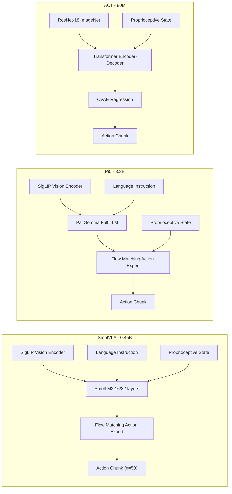

# So sánh Chi tiết SmolVLA vs Baselines: π₀ và ACT

> **Nguồn chính**: SmolVLA: A Vision-Language-Action Model for Affordable and Efficient Robotics (arXiv:2506.01844, 06/2025)

---

## 1. Tổng quan Ba Chính sách Điều khiển

### 1.1. Bản chất Kiến trúc



### 1.2. Bảng So sánh Kiến trúc

| Đặc điểm | **SmolVLA** | **π₀** | **ACT** |
|:--|:--|:--|:--|
| **Số tham số** | **0.45B** (100M action expert) | **3.3B** | **~80M** |
| **VLM Backbone** | SmolVLM-2 (SigLIP + SmolLM2) | PaliGemma (SigLIP + Gemma) | Không có VLM |
| **Vision Encoder** | SigLIP (frozen) | SigLIP (frozen) | ResNet-18 (ImageNet pretrained) |
| **Cơ chế Action Head** | **Flow Matching Transformer** | **Flow Matching** | **CVAE + L1 Regression** |
| **Hiểu ngôn ngữ** | ✅ Có (language instruction) | ✅ Có (language instruction) | ❌ Không |
| **Kiểu attention** | Interleaved CA + Causal SA | Self-Attention | Self + Cross Attention |
| **Visual tokens/frame** | **64** (sau PixelShuffle) | Nhiều hơn (full tiling) | Feature maps từ ResNet |
| **Layer skipping** | ✅ Chỉ dùng 16/32 layers | ❌ Dùng toàn bộ | N/A |
| **Pretraining data** | 23K episodes (community) | **10,000 giờ** robot data (cross-embodiment) | Không pretrain |
| **GPU để train** | **1× consumer GPU** | Nhiều GPU lớn | 1× GPU |
| **Bộ nhớ GPU** | **~2 GB** | **~14+ GB** | **~1-2 GB** |

> **Insight chính**: SmolVLA nhỏ hơn π₀ **7.3 lần** về tham số, nhưng đạt hiệu suất tương đương hoặc vượt trội. So với ACT, SmolVLA lớn hơn ~5.6 lần nhưng có khả năng hiểu ngôn ngữ và tổng quát hóa đa nhiệm mà ACT không có.

---

## 2. Kết quả Simulation: LIBERO & Meta-World

### 2.1. LIBERO Benchmark (40 nhiệm vụ, 4 nhóm)

LIBERO đánh giá khả năng chuyển giao tri thức qua 4 nhóm: **Spatial** (không gian), **Object** (vật thể), **Goal** (mục tiêu), **Long** (chuỗi dài).

| Chính sách | Tham số | LIBERO Avg (%) | Meta-World Avg (%) |
|:--|:--:|:--:|:--:|
| Diffusion Policy | ~100M | — | 10.5 |
| Octo | 93M | 75.1 | — |
| **ACT** | **80M** | — | — |
| OpenVLA | 7B | 76.5 | — |
| π₀ (PaliGemma, no robot pretrain) | 3.3B | 86.0 | — |
| π₀ (robot pretrained) | 3.3B | **90.3** | — |
| **SmolVLA (0.45B)** | **0.45B** | **87.3** | **57.3** |
| SmolVLA (2.25B) | 2.25B | 88.75 | 68.24 |

**Phân tích:**
- SmolVLA (0.45B) **vượt OpenVLA (7B)** +10.8 điểm phần trăm (87.3 vs 76.5)
- SmolVLA (0.45B) **vượt π₀ (PaliGemma, no pretrain)** +1.3 điểm (87.3 vs 86.0)
- SmolVLA (0.45B) chỉ kém π₀ (robot pretrained) -3.0 điểm, nhưng dùng ít tham số hơn **7.3×** và ít dữ liệu pretrain hơn **hàng nghìn lần**
- Trên Meta-World, SmolVLA vượt Diffusion Policy **+46.8 điểm** (57.3 vs 10.5)

### 2.2. Phân tích: Tại sao SmolVLA thắng?

**vs OpenVLA (7B):**
- OpenVLA dùng **Action Tokenization** (rời rạc) → Gây lỗi tích lũy trong quỹ đạo liên tục
- SmolVLA dùng **Flow Matching** (liên tục) → Mô hình hóa phân phối hành động tốt hơn
- SmolVLA chỉ dùng 64 visual tokens → Tính toán hiệu quả hơn, tập trung vào đặc trưng quan trọng

**vs π₀ (3.3B, no pretrain):**
- SmolVLA dùng **interleaved CA+SA** → Kết hợp thông tin VLM tốt hơn pure SA
- SmolVLA dùng **layer skipping** (16/32 layers) → Lớp trung gian chứa đặc trưng cross-modal alignment tốt hơn lớp cuối
- SmolVLA nhận **state vào VLM** (không phải action expert) → Tận dụng tri thức đa phương thức

**vs π₀ (3.3B, robot pretrained):**
- π₀ có lợi thế 10,000 giờ pretrain → SmolVLA chỉ dùng 23K episodes cộng đồng
- Nhưng SmolVLA **train nhanh hơn 40%** và dùng **ít bộ nhớ hơn 6×**

**vs ACT (80M):**
- ACT không có VLM → Không hiểu ngôn ngữ
- ACT dùng CVAE + regression (L1) → Không mô hình hóa phân phối đa phương thức
- ACT không thể multi-task → Phải train riêng từng nhiệm vụ

---

## 3. Kết quả Thực tế: Robot SO-100 & SO-101

### 3.1. SO-100: Ba nhiệm vụ (Table 3 trong paper)

Mỗi task có 50 demonstrations (10 quỹ đạo × 5 vị trí ban đầu). Đánh giá bằng **fine-grained scoring** (0.5 cho gắp + 0.5 cho đặt).

| Chính sách | Chế độ | Pick-Place (%) | Stacking (%) | Sorting (%) | **Trung bình (%)** |
|:--|:--|:--:|:--:|:--:|:--:|
| **ACT** | Single-task | 70 | 50 | 25 | 48.3 |
| **π₀** | Multi-task | **100** | 40 | 45 | 61.7 |
| **SmolVLA** | Multi-task | 75 | **90** | **70** | **78.3** |

#### Phân tích từng nhiệm vụ:

**Pick-Place** (Gắp & Đặt khối vào hộp):
- π₀ thắng tuyệt đối (100%) — lợi thế từ 10,000 giờ pretrain cross-embodiment
- SmolVLA (75%) vượt ACT (70%) dù ACT train riêng cho task này
- SmolVLA kém π₀ ở task đơn giản nhất do ít pretrain data hơn

**Stacking** (Xếp chồng khối):  
- **SmolVLA thắng áp đảo (90%)** — gấp đôi π₀ (40%) và vượt xa ACT (50%)
- Stacking đòi hỏi precision cao → Flow Matching + interleaved attention cho quỹ đạo mượt hơn
- π₀ gặp khó khăn vì task này yêu cầu fine-grained control mà pretrain giúp ít

**Sorting** (Phân loại theo màu):
- **SmolVLA thắng (70%)** — long-horizon task cần hiểu ngôn ngữ
- ACT thấp nhất (25%) — không hiểu language, phải train riêng từng task
- SmolVLA hiểu được "put red cube in right box, blue cube in left box" nhờ VLM

> **Kết luận thực tế**: SmolVLA mạnh nhất ở task đòi hỏi (1) precision cao (stacking) và (2) hiểu ngôn ngữ (sorting). π₀ mạnh ở task đơn giản nhờ pretrain data khổng lồ. ACT yếu nhất khi cần multi-task/language understanding.

### 3.2. SO-101: Generalization sang Robot mới (Table 4)

Task Pick-Place-Lego: Gắp khối lego nhỏ đặt vào hộp trong suốt. SmolVLA **không** pretrain trên SO-101.

| Chính sách | In-Distribution (%) | Out-of-Distribution (%) |
|:--|:--:|:--:|
| **ACT** | 70 | 40 |
| **SmolVLA** | **90** | **50** |

SmolVLA vượt ACT **+20%** in-distribution và **+10%** OOD → khái quát hóa tốt cho robot mới.

### 3.3. Hiệu quả Pretraining trên Dữ liệu Cộng đồng (Table 5)

| Cấu hình | Pick-Place | Stacking | Sorting | **Avg (%)** |
|:--|:--:|:--:|:--:|:--:|
| SmolVLA (no pretrain, single-task) | 65 | 55 | 35 | 51.7 |
| SmolVLA (pretrained, single-task) | 75 | 80 | 55 | 70.0 |
| SmolVLA (pretrained, multi-task) | 75 | 90 | 70 | **78.3** |

- Pretrain trên community data: **+18.3 điểm** (51.7 → 70.0)
- Multi-task finetuning thêm: **+8.3 điểm** (70.0 → 78.3)
- Tổng cải thiện: **+26.6 điểm**

---

## 4. Suy luận Bất đồng bộ: Sync vs Async

### 4.1. Kết quả (Figure 5)

| Chế độ | Thời gian (s) | Số task/60s | SR (%) | Đặc điểm |
|:--|:--:|:--:|:--:|:--|
| **Sync** | 13.75 | 9 | ~78 | Có idle gaps |
| **Async (g=0.7)** | **9.70** | **19** | ~78 | Liên tục, mượt |

- Nhanh hơn **~30%** (13.75 → 9.70s)
- Thông lượng gấp **2.1×** (9 → 19 tasks/phút)
- Không giảm success rate

### 4.2. Cơ chế

```
Sync (g=0):   Execute chunk → IDLE (wait for infer) → Execute → IDLE
Async (g=0.7): Execute chunk → [overlap: infer next] → Execute → [overlap]

Khi còn 30% hành động trong queue → trigger inference mới
Async là model-agnostic: áp dụng được cho ACT, π₀, Diffusion Policy
```

---

## 5. Ablation Studies: Design Choices Quan trọng

### 5.1. Attention Mechanism (Table 6)

| Cấu hình | Kết quả |
|:--|:--|
| Self-Attention only (như π₀) | Thấp nhất |
| Cross-Attention only | Cao hơn SA |
| **Interleaved SA + CA (SmolVLA)** | **Cao nhất** |

### 5.2. Causal vs Bidirectional (Table 7)

| Cấu hình | Kết quả |
|:--|:--|
| Pure CA (không tương tác giữa actions) | Cạnh tranh |
| **Causal SA** | **Tốt nhất** |
| Bidirectional SA | Tệ nhất |

### 5.3. Layer Skipping (Table 8)

| Layers | Performance | Speed |
|:--|:--|:--|
| 32/32 layers | Baseline | 1× |
| Skip mỗi layer thứ 2 | Khá tốt | ~1.5× |
| **16/32 layers đầu (N=L/2)** | **Trade-off tốt nhất** | **~2×** |
| 8/32 layers đầu | Giảm rõ | ~3× |

> **Phát hiện**: Lớp trung gian VLM chứa cross-modal alignment tốt hơn lớp cuối. Dùng 50% layers = giảm 50% compute.

### 5.4. Flow Matching vs Regression (Table 10) 

| Objective | Kết quả |
|:--|:--|
| L1 Regression (như ACT) | Thấp hơn đáng kể |
| **Flow Matching** | **Cao hơn nhiều** |

### 5.5. State Location (Table 11)

| Vị trí State | Kết quả |
|:--|:--|
| State → Action Expert (như π₀) | Thấp hơn |
| **State → VLM (SmolVLA)** | **Cao hơn đáng kể** |

### 5.6. Action Chunk Size (Table 12)

| Chunk size n | Kết quả |
|:--|:--|
| n=5 | Thấp (quá reactive) |
| n=10-50 | **Vùng tối ưu** |
| n=100 | Giảm (open-loop quá dài) |

---

## 6. Chi phí Tính toán

| Metric | SmolVLA | π₀ | ACT |
|:--|:--|:--|:--|
| GPU cần thiết | **1× RTX 3090** | Nhiều GPU | 1× GPU |
| Bộ nhớ GPU | **~2 GB** | ~14+ GB | ~1-2 GB |
| Train time (1 GPU) | ~4-8h (A100) | Không thể 1 GPU | ~2-4h |
| CPU inference | ✅ | ❌ | ✅ |
| Edge device | ✅ Jetson | ❌ | ✅ |

---

## 7. Tổng hợp

### SmolVLA THẮNG:

| | vs π₀ | vs ACT |
|:--|:--|:--|
| Hiệu quả tham số | Nhỏ hơn 7.3× | Lớn hơn 5.6× nhưng multi-task |
| Stacking (precision) | **90% vs 40%** | **90% vs 50%** |
| Sorting (language) | **70% vs 45%** | **70% vs 25%** |
| Training cost | 40% faster, 6× less memory | Tương đương |
| Edge deployment | CPU-capable | Không thể |

### SmolVLA THUA:

| | vs π₀ | vs ACT |
|:--|:--|:--|
| Pick-Place (simple) | 75% vs **100%** | 75% vs 70% (vẫn thắng nhẹ) |
| LIBERO (pretrained π₀) | 87.3% vs **90.3%** | — |
| Inference speed (1 pass) | Nhanh hơn | Chậm hơn (flow matching 10 steps) |

---

## 8. Cấu hình Tái tạo

```python
# SmolVLA
smolvla = {
    "vlm": "SmolVLM-2", "layers": 16, "tokens": 64,
    "action_head": "Flow Matching", "chunk": 50,
    "attention": "interleaved CA+SA", "state_to": "VLM",
    "optimizer": "AdamW(lr=1e-4, cosine, bfloat16)",
    "pretrain": "200K steps, batch=256, 23K episodes",
    "finetune_sim": "100K steps, batch=64",
    "inference": "10 flow steps, async g=0.7",
}

# π₀
pi0 = {
    "vlm": "PaliGemma (3B)", "action_head": "Flow Matching",
    "state_to": "Action Expert", "attention": "SA only",
    "pretrain": "10,000 hours cross-embodiment",
}

# ACT
act = {
    "encoder": "ResNet-18", "architecture": "CVAE Transformer",
    "objective": "L1 Regression", "language": False,
    "mode": "Single-task only",
}
```

---

## 9. Experimental Variant in This Repo

Repo hiện đã có thêm biến thể nghiên cứu:

- `finetune_lyapunov_tokenbottleneck_snapflow02.py`

Biến thể này giữ backbone SmolVLA nhưng thay các thành phần tối ưu bằng:

- Lyapunov-stable dynamic depth gating
- Variational Token Bottleneck pruning
- SnapFlow second-order curvature-aware distillation

Output chuẩn tương thích evaluator hiện có:

- `final_model.pt`
- `dynamic_report.json`
- `dynamic_comparison_plots.png`
